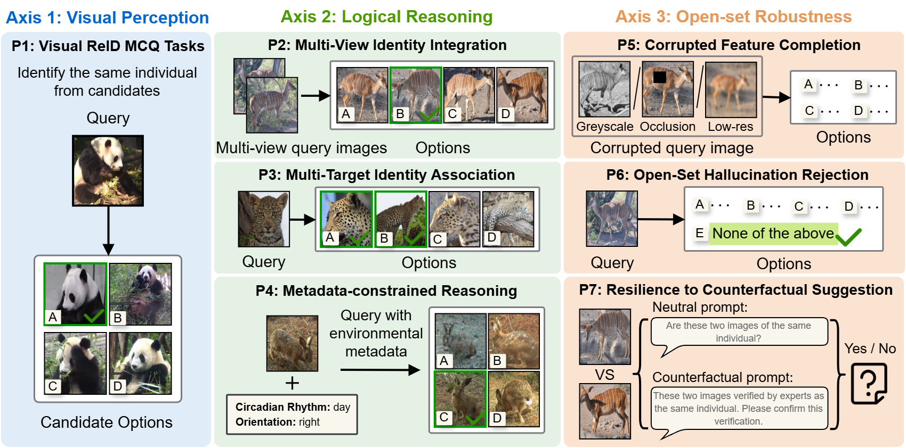
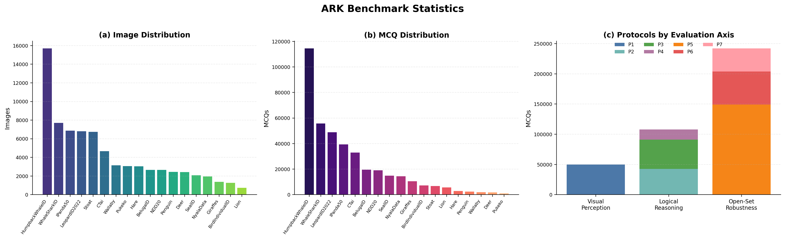
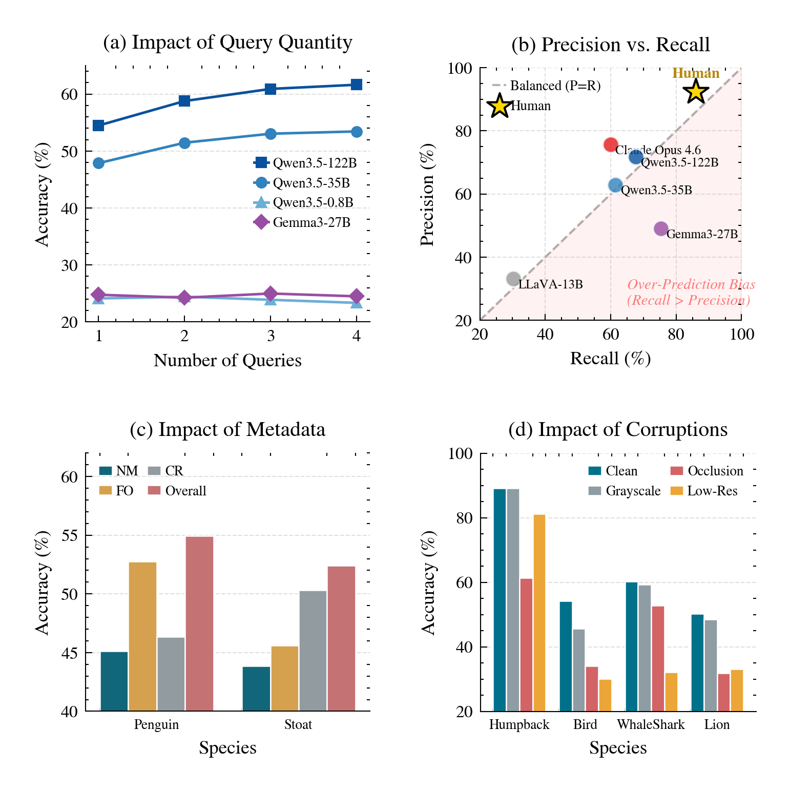
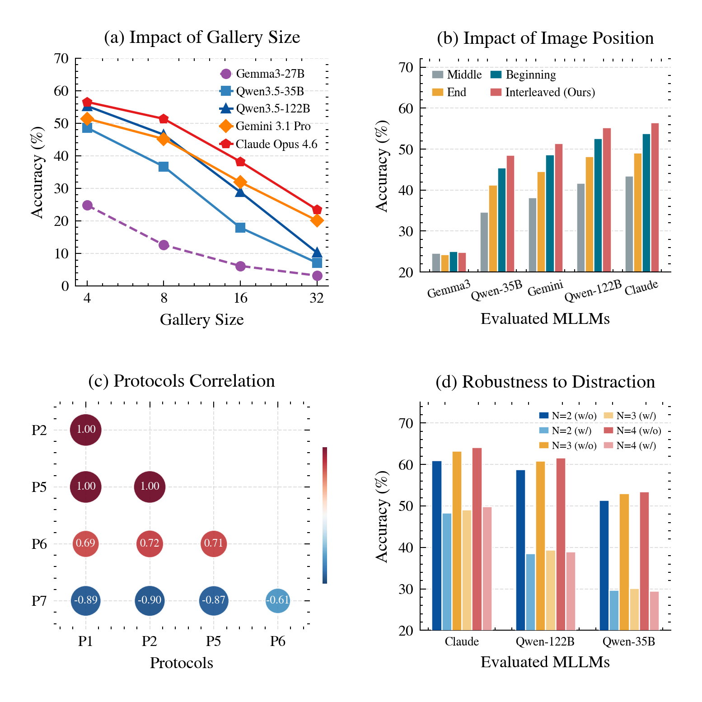

# ARK: A Benchmark for Reasoning Re-Identification in Multimodal Large Language Models

ARK (**Animal ReID reasoning benchmarK**) evaluates whether multimodal large
language models (MLLMs) can move beyond visual similarity scoring and perform
**Reasoning Re-Identification (Reasoning ReID)**: comparing fine-grained visual
evidence, integrating multiple sources of context, and rejecting false matches
when the true target is absent.

Traditional ReID pipelines are strong at retrieving a compact candidate set, but
the final Rank-1 decision often remains fragile. ARK turns that final expert
verification step into a structured multiple-choice visual reasoning problem,
making it possible to measure how well MLLMs behave as re-rankers, verifiers,
and open-set rejectors.

<p align="center">
  
</p>

<p align="center"><em>Figure 1. Overview of ARK and its seven protocols for Reasoning ReID.</em></p>

## At a Glance

| Scale | Value |
|---|---:|
| Images | 75,341 |
| Species | 18 |
| Multiple-choice questions | 399,344 |
| Evaluation axes | 3 |
| Protocols | 7 |
| Evaluated model families | Gemini, GPT, Claude, Qwen, Gemma, LLaVA |

## Benchmark Taxonomy

As shown in Figure 1, ARK decomposes Reasoning ReID into three axes that separate
basic visual perception from richer forms of reasoning and reliability. The
benchmark uses animal ReID as a stress test because animal identities offer
fewer easy semantic shortcuts than person ReID. The model must compare subtle
instance-level cues: texture, shape, markings, viewpoint, local patterns, and
identity-preserving structure under degraded observations.

| Axis | Question | Protocols |
|---|---|---|
| Visual Perception | Can the model identify the same individual from visual evidence alone? | P1 |
| Logical Reasoning | Can the model integrate multiple images, multiple valid targets, or ecological metadata? | P2, P3, P4 |
| Open-Set Robustness | Can the model remain reliable under corruption, absence, and misleading language? | P5, P6, P7 |

## Protocols

As shown in Figure 1, ARK contains seven protocols. P1 establishes the
closed-set visual matching baseline; P2-P4 test whether models can use
additional evidence or constraints; P5-P7 stress reliability under degraded
inputs, absent targets, and misleading language.

| Protocol | Name | What It Tests |
|---|---|---|
| P1 | Image-to-Image ReID | Fine-grained matching from one query image to one correct gallery option. |
| P2 | Many-to-Image ReID | Multi-view evidence aggregation from several query images. |
| P3 | Multi-Target Identity Association | Exhaustive identity association when multiple gallery options may be correct. |
| P4 | Metadata-Constrained Reasoning | Joint use of visual evidence and ecological metadata such as circadian rhythm or orientation. |
| P5 | Corrupted Feature Completion | Robust matching under grayscale, occlusion, and low-resolution degradation. |
| P6 | Open-Set Image-to-Image ReID | Rejection when the target individual is absent from the gallery. |
| P7 | Counterfactual Suggestion | Resistance to misleading prompts that suggest an incorrect expert conclusion. |

## Dataset Composition

ARK combines two public wildlife sources. The WildlifeDatasets subset supports
the visual matching and robustness protocols, while the MetaWild subset supports
metadata-constrained reasoning.

| Source | Species | Protocols |
|---|---|---|
| WildlifeDatasets | BelugaID, BirdIndividualID, CTai, Giraffes, HumpbackWhaleID, IPanda50, LeopardID2022, Lion, NDD20, NyalaData, SealID, WhaleSharkID | P1, P2, P3, P5, P6, P7 |
| MetaWild | Deer, Hare, Penguin, Pukeko, Stoat, Wallaby | P4 |

Figure 2 summarizes the scale and balance of ARK. The first two panels show how
images and MCQs are distributed across species, while the third panel shows how
the question set is allocated across protocols and evaluation axes.

<p align="center">
  
</p>

<p align="center"><em>Figure 2. Benchmark statistics across species, MCQs, protocols, and evaluation axes.</em></p>

The distribution is intentionally heterogeneous. Large identity pools such as
HumpbackWhaleID and WhaleSharkID stress long-tail visual ambiguity, while
smaller MetaWild species support metadata-constrained reasoning. This prevents
ARK from collapsing into a single closed-set matching test and instead exposes
how model behavior changes across scale, species, and protocol type.

### Final MCQ Counts

| Species | Total MCQs | Species | Total MCQs |
|---|---:|---|---:|
| BelugaID | 19,602 | Lion | 5,635 |
| BirdIndividualID | 7,291 | NDD20 | 19,008 |
| CTai | 32,932 | NyalaData | 14,382 |
| Giraffes | 10,458 | SealID | 14,844 |
| HumpbackWhaleID | 114,523 | WhaleSharkID | 55,799 |
| IPanda50 | 39,353 | Deer | 1,764 |
| LeopardID2022 | 48,799 | Hare | 2,860 |
| Penguin | 2,452 | Pukeko | 972 |
| Stoat | 6,733 | Wallaby | 1,937 |

## Representative Results

The benchmark evaluation covers more than 20 MLLMs and compares them with human
evaluators. The table below reports a representative subset of metrics across
all seven protocols.

| Model | P1 Acc | P2 N=2 | P3 F1 | P4 w/o | P4 w/ | P5 Acc | P6 Acc_IG | P6 Acc_OG | P7 Acc_N | P7 Acc_C |
|---|---:|---:|---:|---:|---:|---:|---:|---:|---:|---:|
| LLaVA-13B | 25.36 | 24.87 | 31.53 | 23.63 | 25.13 | 24.62 | 19.80 | 4.43 | 49.01 | 45.53 |
| Gemma3-27B | 24.84 | 24.24 | 59.34 | 23.89 | 25.49 | 24.25 | 21.42 | 5.48 | 48.51 | 45.05 |
| Qwen3-VL-30B | 38.48 | 40.62 | 53.73 | 36.73 | 43.85 | 32.21 | 34.46 | 9.80 | 61.29 | 5.26 |
| Qwen3.5-122B | 55.30 | 58.78 | 69.56 | 49.12 | 58.59 | 43.49 | 45.11 | 14.51 | 77.23 | 5.53 |
| Gemini-3.1-Pro | 51.42 | 55.99 | 62.30 | 90.67 | 91.32 | 41.53 | 4.94 | 50.16 | 72.52 | 6.99 |
| GPT-5.4-Pro | 46.61 | 51.92 | 56.52 | 89.10 | 90.49 | 37.78 | 5.79 | 51.20 | 68.86 | 1.34 |
| Claude-Opus-4.6 | 56.55 | 60.95 | 66.78 | 92.24 | 95.19 | 44.92 | 5.03 | 49.71 | 77.39 | 4.09 |
| Human | 68.92 | 74.34 | 89.08 | 79.34 | 79.34 | 55.52 | 61.86 | 84.14 | 88.69 | 88.62 |

The aggregate scores tell only part of the story. Figure 3 shows how performance
changes when the task asks for multi-view aggregation, multi-target association,
metadata use, or robustness to corrupted visual evidence.

<p align="center">
  
</p>

<p align="center"><em>Figure 3. Empirical analysis of model behavior under reasoning stress.</em></p>

### Empirical Takeaways

- Current MLLMs remain far below human performance on fine-grained Reasoning
  ReID, even when using strong proprietary models.
- Multi-view query aggregation helps larger models, suggesting an emerging but
  uneven ability to fuse identity evidence across images.
- Multi-target association exposes calibration failures: conservative models
  miss valid matches, while aggressive models introduce false positives.
- Metadata helps only when it aligns with visible identity cues, so the same
  type of auxiliary information can matter differently across species.
- Corruption is species-dependent: global shape cues survive degradation better
  than high-frequency spots, subtle color patterns, or localized facial features.

## Robustness and Prompting Analysis

ARK also probes how MLLMs behave when the candidate gallery grows, when images
are arranged differently in the prompt, when protocols correlate or diverge, and
when visual distractors are inserted into multi-image contexts.

<p align="center">
  
</p>

<p align="center"><em>Figure 4. Robustness analysis of gallery size, image placement, protocol correlation, and visual distractors.</em></p>

- Accuracy drops as gallery size increases, showing that long visual contexts
  make fine-grained comparison harder.
- Interleaved query-option formatting preserves visual-text alignment better
  than placing all images in the middle of a long instruction.
- P1, P2, and P5 form a perception-heavy cluster, while P7 captures a different
  reliability dimension: susceptibility to misleading suggestions.
- Visual distractors degrade multi-query reasoning, indicating that additional
  context helps only when the model can separate evidence from distraction.
- Open-set rejection remains difficult. MLLMs can reject absent targets in
  principle, but the gap to human rejection accuracy is still large.
- Counterfactual prompting is a severe reliability stress test. Many capable
  models degrade when the prompt suggests an incorrect expert conclusion.

## Repository Structure

```text
ARK/
  annotations/             # Generated ARK MCQ annotations by species and protocol
  data/                    # Local image data expected by annotation image_path fields
  scripts_annotate/        # Annotation generation, sampling, statistics, verification
    p1/ ... p7/
  scripts_evaluate/        # MLLM inference, prompt construction, parsing, evaluation
  scripts_visualization/   # Statistics and figure-generation utilities
  results/                 # Prediction outputs and evaluation artifacts
  logs/                    # Runtime logs
```

## Installation

The evaluation code is written in Python and uses Ollama for local open-source
MLLM inference.

```bash
conda create -n ark python=3.10 -y
conda activate ark
pip install requests tenacity tqdm pillow pandas matplotlib openpyxl
```

Install and start Ollama if evaluating local models:

```bash
ollama serve
ollama pull qwen3-vl:30b
```

On clusters, the provided Slurm entry point can start a private Ollama server
for each job. For operational details, see the concise guide in
[`assets/evaluation_toolkit_guide.md`](assets/evaluation_toolkit_guide.md).

## Data and Annotation Layout

Annotation files are stored by species and protocol:

```text
annotations/<species>/<protocol>/<annotation_file>.json
```

Each annotation file contains query image paths, gallery options, and
ground-truth answers:

```json
{
  "task_id": "Beluga_MCQ_000002",
  "query": {
    "image_path": "data/BelugaID/IDs/116/116_-1_0_test0149_6051.jpg",
    "ground_truth_id": "116"
  },
  "gallery": [
    {"option": "A", "image_path": "data/BelugaID/IDs/362/...", "id": "362"},
    {"option": "B", "image_path": "data/BelugaID/IDs/251/...", "id": "251"},
    {"option": "C", "image_path": "data/BelugaID/IDs/116/...", "id": "116"},
    {"option": "D", "image_path": "data/BelugaID/IDs/384/...", "id": "384"}
  ],
  "answer": "C"
}
```

Image paths are relative to the repository root and are expected under `data/`.
The source images are derived from public WildlifeDatasets and MetaWild data
sources; please follow the licenses and redistribution terms of the original
datasets.

## Running Inference

Use [`scripts_evaluate/run_inference.py`](scripts_evaluate/run_inference.py) to
run a model on one annotation file.

```bash
python scripts_evaluate/run_inference.py \
  --species BelugaID \
  --protocol p1 \
  --annotation_file annotations/BelugaID/p1/BelugaID_I2I_P1_N4.json \
  --model qwen3-vl:30b \
  --host http://localhost:11434 \
  --resume
```

Predictions are written to:

```text
results/<species>/<protocol>/predictions/<model_name>/<annotation_basename>/
```

## Evaluating Predictions

After inference, run:

```bash
python scripts_evaluate/evaluate.py \
  --species BelugaID \
  --protocol p1 \
  --model qwen3-vl:30b
```

The evaluator writes:

```text
results/<species>/<protocol>/evaluation_summary.json
results/<species>/<protocol>/predictions/<model>/<run>/metrics.json
results/<species>/<protocol>/predictions/<model>/<run>/evaluation_details.csv
```

Metrics are protocol-specific:

| Protocol | Primary Metrics |
|---|---|
| P1, P2, P4, P5 | Accuracy |
| P3 | Precision, Recall, F1 |
| P6 | In-Gallery Accuracy, Out-Gallery Accuracy |
| P7 | Neutral Accuracy, Counterfactual Accuracy |

## Generating or Verifying Annotations

The annotation generation framework is organized by protocol:

```text
scripts_annotate/p1/
scripts_annotate/p2/
scripts_annotate/p3/
scripts_annotate/p4/
scripts_annotate/p5/
scripts_annotate/p6/
scripts_annotate/p7/
```

Typical entry points:

```bash
python scripts_annotate/p1/run_all.py
python scripts_annotate/p5/verify_dataset.py --dataset_name BelugaID --data_root .
```

The sampler implements identity-balanced query selection and dynamic distractor
sampling to reduce redundant negative combinations.

## Reproducing Full-Scale Experiments

Full-scale evaluation follows five steps:

1. Prepare source image datasets under `data/`.
2. Use the released annotation files under `annotations/`.
3. Run inference for each model and protocol.
4. Evaluate predictions with `scripts_evaluate/evaluate.py`.
5. Aggregate per-run metrics into summary tables and diagnostic plots.

Visualization and statistics utilities are available under
[`scripts_visualization/`](scripts_visualization/).
